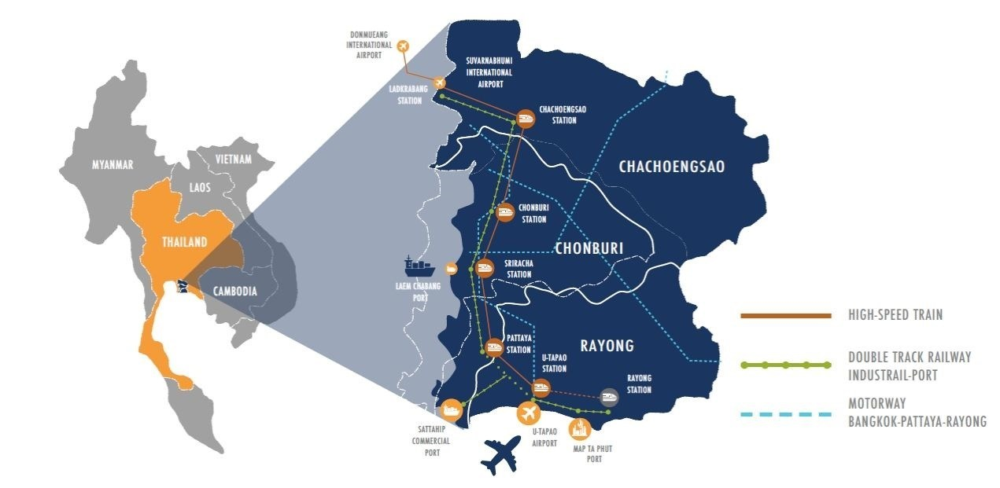

# Table of Contents

1.  [Service Area Coverage](#orgdbae77a)
2.  [Scope of Services](#org45bfe2c)
3.  [Service Sponsorship](#org5224106)
4.  [Regulatory Requirements](#org18c6379)
    1.  [Air Operator License (AOL)](#org151af80)
    2.  [Air Operator Certificate (AOC)](#orgf4e9df1)
    3.  [AOC Mandatory Manuals](#orga860e54)
5.  [Operational Requirements](#org656de47)
    1.  [Helicopters & Medical Equipment](#org4b765c3)
        1.  [HEMS Medical Platform Installation](#org8117b2c)
        2.  [Portable Airborne Medical Equipments](#org32c4c8e)
    2.  [Heliport/Helipad & Airport/Airfield](#org2185c58)
    3.  [HEMS Main-base & Command Center](#orgdae7703)
    4.  [Human Resources](#org9ccf094)
6.  [Financial Requirement](#org9aeacd6)

# Service Area Coverage

Eastern Economic Corridor (EEC) Special Economic Zone, Thailand

# Scope of Services

-   Aeromedical transport & evacuation of emergency patients by means of helicopter emergency medical services<a id="fnr.1" class="footref" href="#fn.1">1</a> from designated landing sites to recieving hospitals helipad/landing fields.

-   Availability:
    -   Sunrise to sunset (approximately 12 hours daily coverage)
    -   Seven days a week

# Service Sponsorship

-   Corporate Membership & Insurance Program
-   Governmennt Contract with Eastern Economic Corridor (EEC) Office of Thailand

About EEC of Thailand 
<https://www.eeco.or.th/en/vision-mission> 

# Regulatory Requirements

## Air Operator License (AOL)

An aviation business plan with clear commercial objectives with specific aircrafts or helicopter type and models including sources of acquisition and financial details are required for submission to Civil Aviation Authority of Thailand (CAAT). The business with specific forms will be reviewed by CAAT and proposed to the Civil Aviation Commission. The commission will scrutinized the applicants to its satisfaction before further submission to Ministry of Transport for final approval.

Should the AOL be granteed, the AOL holder is obliged to soource or import aircrafts into Thailand within 2 years.

## Air Operator Certificate (AOC)

The AOL holder has an obligation to perform the CAAT regulatory compliances in order to commercially operate its aircrafts/helicopters.

The AOL holder is required to have a designated Accountable Manager with the highest company management authority and to be accooutable for any actions and ignorant in CAAT compliances, and including accooutable for criminal penalty with related governing related laws.

The company need to structure the company oorganization in compliances with CAAT regulations for aviation safety and standards. The company need to develop series of company manuals which required CAAT approval and series of periodic audit and random surveillance.

## AOC Mandatory Manuals

Company manuals typically include the following.

-   Security Program Manual (SPM)
-   Safety Management System Manual (SMSM)
-   Quality Assurance Manual (QAM)
-   Operations Manual (OM)
-   Minimum Equipment List (MEL)
-   Maintenance Program (MP)
-   Global Reporting Format Manual (GRFM)
-   General Maintenance Manual (GMM)
-   Flight Dispatch Manual (FDM)
-   Emergency Manual (EM)
-   Aviation Security Training Program Manual (ASTP)

# Operational Requirements

## Helicopters & Medical Equipment

### HEMS Medical Platform Installation

-   Medical floor & electrical system
-   Medical wall racking system

### Portable Airborne Medical Equipments

-   Medical sliding bed
-   Flight crew revolving seating system

## Heliport/Helipad & Airport/Airfield

-   Helipad Establishment & Management
    -   Helipad design & construction
    -   Helipad marshaller & ground operation support

## HEMS Main-base & Command Center

-   Helicopter Hangarage & Maintenance
-   HEMS Alarm & Coordination Center
-   Flight Crew & Flight Dispatch Center

## Human Resources

-   Pilots
-   Certified Flight Doctors & Flight Nurses
-   Maintenance Engineers
-   Ground Operation Crew

# Financial Requirement

Details to be provided.

# Footnotes

<a id="fn.1" href="#fnr.1">1</a> Helicopter equipped with medical necessities for medical life support and emergency treatments by specially trained aviation medicine doctors and paramedic personnel
