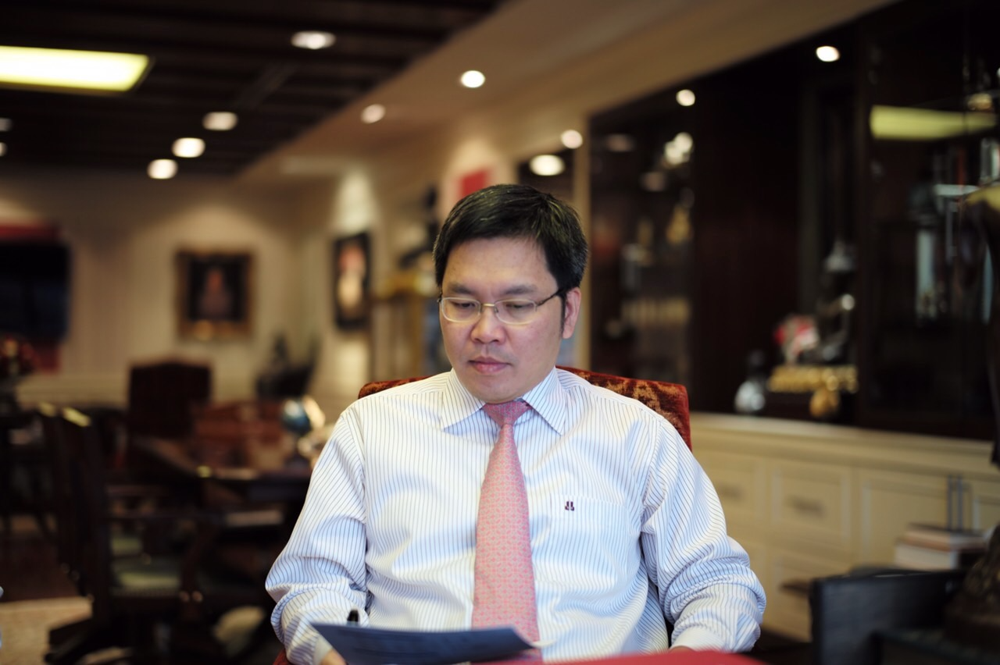

# Table of Contents

1.  [Bio Data](#org2150141)
2.  [Educations](#org0d23d17)
3.  [Work Experiences](#orgacf90ba)
4.  [Skills & Experiences](#org64c50bf)
    1.  [Programming (Mostly on Unix & MacOS):](#orgc9a4897)
    2.  [Technical Support and Sales & Marketing Management Experiences:](#orgd509dc3)
    3.  [Helicopter Sales & Technical/Operational Logistics Management:](#org41fe8e0)
    4.  [Aeromedical Transport & Emergency Medical Services:](#org4d73ff9)
    5.  [Aircrafts Management:](#orgd468732)
5.  [Contact Address](#org606c2d2)

# Bio Data

<table border="2" cellspacing="0" cellpadding="6" rules="groups" frame="hsides">

<colgroup>
<col  class="org-left" />

<col  class="org-left" />
</colgroup>
<tbody>
<tr>
<td class="org-left">Date of Birth:</td>
<td class="org-left">27th January 1972</td>
</tr>

<tr>
<td class="org-left">Place of Birth:</td>
<td class="org-left">Chiangmai, Thailand</td>
</tr>

<tr>
<td class="org-left">Nationality:</td>
<td class="org-left">Thai</td>
</tr>

<tr>
<td class="org-left">Gender:</td>
<td class="org-left">Male</td>
</tr>

<tr>
<td class="org-left">Marital Status:</td>
<td class="org-left">Married and has a daughter</td>
</tr>
</tbody>
</table>

# Educations

<table border="2" cellspacing="0" cellpadding="6" rules="groups" frame="hsides">

<colgroup>
<col  class="org-left" />

<col  class="org-left" />
</colgroup>
<tbody>
<tr>
<td class="org-left">1992 - 1996</td>
<td class="org-left"><b>University of New England</b>, New South Wales, Australia</td>
</tr>

<tr>
<td class="org-left">&#xa0;</td>
<td class="org-left">B.Eng (Electronics &amp; Communications Engineering)</td>
</tr>

<tr>
<td class="org-left">1997</td>
<td class="org-left"><b>The Institution of Engineers-Australia</b></td>
</tr>

<tr>
<td class="org-left">&#xa0;</td>
<td class="org-left">Grad MIEAust</td>
</tr>

<tr>
<td class="org-left">1999 - 2001</td>
<td class="org-left"><b>Chulalongkorn University</b>, Bangkok, Thailand</td>
</tr>

<tr>
<td class="org-left">&#xa0;</td>
<td class="org-left">M.B.A. (Management)</td>
</tr>

<tr>
<td class="org-left">2002 - 2007</td>
<td class="org-left"><b>National Institute of Development Administration</b>, Bangkok, Thailand</td>
</tr>

<tr>
<td class="org-left">&#xa0;</td>
<td class="org-left">Ph.D. (Public Administration) Completed Course Work</td>
</tr>

<tr>
<td class="org-left">2010 - 2011</td>
<td class="org-left"><b>King's Prajadipok's Institute</b>, Bangkok, Thailand</td>
</tr>

<tr>
<td class="org-left">&#xa0;</td>
<td class="org-left">Certifacate (ASEAN Economic Studies)</td>
</tr>

<tr>
<td class="org-left">2012 - 2013</td>
<td class="org-left"><b>King's Prajadipok's Institute</b>, Bangkok, Thailand</td>
</tr>

<tr>
<td class="org-left">&#xa0;</td>
<td class="org-left">Advance Certificate (Public Economic Management)</td>
</tr>
</tbody>
</table>

# Work Experiences

<table border="2" cellspacing="0" cellpadding="6" rules="groups" frame="hsides">

<colgroup>
<col  class="org-left" />

<col  class="org-left" />
</colgroup>
<tbody>
<tr>
<td class="org-left">1996 - 1998</td>
<td class="org-left"><b>Hollywood International Co., Ltd.</b>, Bangkok, Thailand</td>
</tr>

<tr>
<td class="org-left">&#xa0;</td>
<td class="org-left">Military Products Division</td>
</tr>

<tr>
<td class="org-left">&#xa0;</td>
<td class="org-left">- Product Specialist</td>
</tr>

<tr>
<td class="org-left">1998 - 1999</td>
<td class="org-left"><b>International Training Australia Pty, Ltd.</b>, Melbourne, Australia</td>
</tr>

<tr>
<td class="org-left">&#xa0;</td>
<td class="org-left">2-year contractual work for Ministry of Educations of Thailand</td>
</tr>

<tr>
<td class="org-left">&#xa0;</td>
<td class="org-left">- Telecommunication Technology Trainer</td>
</tr>

<tr>
<td class="org-left">1999 - 2001</td>
<td class="org-left"><b>Kistler Instrument Pty., Ltd.</b>, Singapore</td>
</tr>

<tr>
<td class="org-left">&#xa0;</td>
<td class="org-left">- Technical Support Engineer</td>
</tr>

<tr>
<td class="org-left">&#xa0;</td>
<td class="org-left">- Product Manager</td>
</tr>

<tr>
<td class="org-left">2002 - 2006</td>
<td class="org-left"><b>Pac-Rim International (Loxley Group)</b>, Bangkok, Thailand</td>
</tr>

<tr>
<td class="org-left">&#xa0;</td>
<td class="org-left">- Assistant Vice President</td>
</tr>

<tr>
<td class="org-left">&#xa0;</td>
<td class="org-left"><b>General Aviation Co., Ltd.</b></td>
</tr>

<tr>
<td class="org-left">&#xa0;</td>
<td class="org-left"><i>Bell Helicopter Aircraft &amp; Spare Parts Division</i></td>
</tr>

<tr>
<td class="org-left">&#xa0;</td>
<td class="org-left">- Helicopter Sales Manager</td>
</tr>

<tr>
<td class="org-left">2007 - 2015</td>
<td class="org-left"><b>Bangkok Dusit Medical Services PCL</b>, Bangkok, Thailand</td>
</tr>

<tr>
<td class="org-left">&#xa0;</td>
<td class="org-left"><i>Bangkok Hospital Head Quardter (Soi Soon -Vijai) Director Office</i></td>
</tr>

<tr>
<td class="org-left">2007</td>
<td class="org-left">- Office Manager</td>
</tr>

<tr>
<td class="org-left">&#xa0;</td>
<td class="org-left"><i>Aviation Medicine Department</i></td>
</tr>

<tr>
<td class="org-left">2008 -2015</td>
<td class="org-left">- Flight Operations Manager</td>
</tr>

<tr>
<td class="org-left">&#xa0;</td>
<td class="org-left"><i>Marketing Division</i></td>
</tr>

<tr>
<td class="org-left">2009 - 2015</td>
<td class="org-left">- Senior Corporate &amp; Insurance Manager</td>
</tr>

<tr>
<td class="org-left">2015 - 2022</td>
<td class="org-left"><b>Sino-Thai Engineering &amp; Construction PCL</b>, Bangkok, Thailand</td>
</tr>

<tr>
<td class="org-left">&#xa0;</td>
<td class="org-left">- Advisor to the President</td>
</tr>

<tr>
<td class="org-left">&#xa0;</td>
<td class="org-left"><b>AC Aviation Co., Ltd.</b></td>
</tr>

<tr>
<td class="org-left">2015 - 2022</td>
<td class="org-left">- Board of Director Member</td>
</tr>

<tr>
<td class="org-left">2020 - 2022</td>
<td class="org-left">- General Manager (Air Operator Certificate Holder Accountable Manager)</td>
</tr>

<tr>
<td class="org-left">2015 - 2019</td>
<td class="org-left"><b>Samui R &amp; D Co., Ltd.</b></td>
</tr>

<tr>
<td class="org-left">&#xa0;</td>
<td class="org-left">- Board of Director Member &amp; Executive Director</td>
</tr>

<tr>
<td class="org-left">2019 - 2022</td>
<td class="org-left"><b>Siam Premises Co., Ltd.</b></td>
</tr>

<tr>
<td class="org-left">&#xa0;</td>
<td class="org-left">- Board of Director Member</td>
</tr>
</tbody>
</table>

# Skills & Experiences

## Programming (Mostly on Unix & MacOS):

-   C/C++
-   Go
-   Rust
-   Emacs LISP
-   LaTeX

## Technical Support and Sales & Marketing Management Experiences:

-   In industrial instrumentation R&D and production quality assurance
-   In healthcare for Corporate & Insurance segments with great familiar in PPO<a id="fnr.1" class="footref" href="#fn.1">1</a>
-   Strategic pricing
-   Healthcare service provision strategies for;
    -   Occupational Medicine compliances for SHE/OSHA, Offshore work regulations
    -   Aviation Medicine for ICAO regulatory compliances for airline personnel and passengers
    -   Corporate healthcare services; annual medical checkup, pre-employment screening, company OPD/IPD managed care/pricing, return-to-work examination, narcotics & drug abuses, health promotion and office wellness programs including vitality partnerships with insurances

## Helicopter Sales & Technical/Operational Logistics Management:

-   Military & Police: Bell UH-1H, Bell 212, Bell 412/EP
-   Civilian: Airbus (Eurocopter) EC145s

## Aeromedical Transport & Emergency Medical Services:

-   Intensive training and real-life operational experiences in Aircraft & HEMS <a id="fnr.2" class="footref" href="#fn.2">2</a>
-   Experienced with EURAMI & CAMTS Accreditation & CAAT Compliances

## Aircrafts Management:

-   Hawker 850XP, Embraer Legacy 600 (EMB-135BJ)
-   Familiar with Civil Aviation Authority of Thailand Re-Certification Regulations<a id="fnr.3" class="footref" href="#fn.3">3</a> 
    Was responsible as Accountable Manager for AOC<a id="fnr.4" class="footref" href="#fn.4">4</a> AOL<a id="fnr.5" class="footref" href="#fn.5">5</a>

# Contact Address

**Permanent & Current**

152/75 Similan Reef Village,   
Pattana Chonabot 4 Road,   
Klong Song Ton Noon Subdistrict,   
Ladkrabang District,   
Bangkok 10520 Thailand   

Mobile Phone number: +66 (0)81 889 3482 

E-mail:	pkhonjum@gmail.com 

# Footnotes

<a id="fn.1" href="#fnr.1">1</a> PPO abbreviates for Preferred Provider Organzations

<a id="fn.2" href="#fnr.2">2</a> HEMS abbreviates for Helicopter Emergency Medical Services

<a id="fn.3" href="#fnr.3">3</a> AOC-R is highy stringent regulatory requirement for all air operators in Thailand

<a id="fn.4" href="#fnr.4">4</a> AOC abbreviates for Air Operator Certificate

<a id="fn.5" href="#fnr.5">5</a> AOL abbreviates for Air Operator License License Holder
